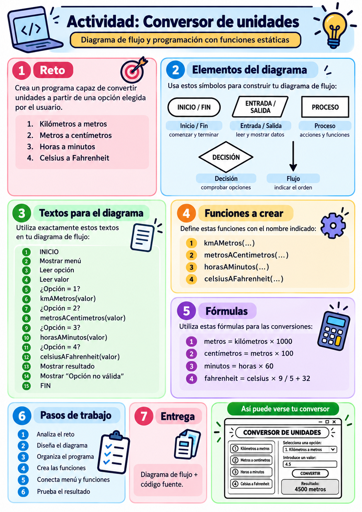
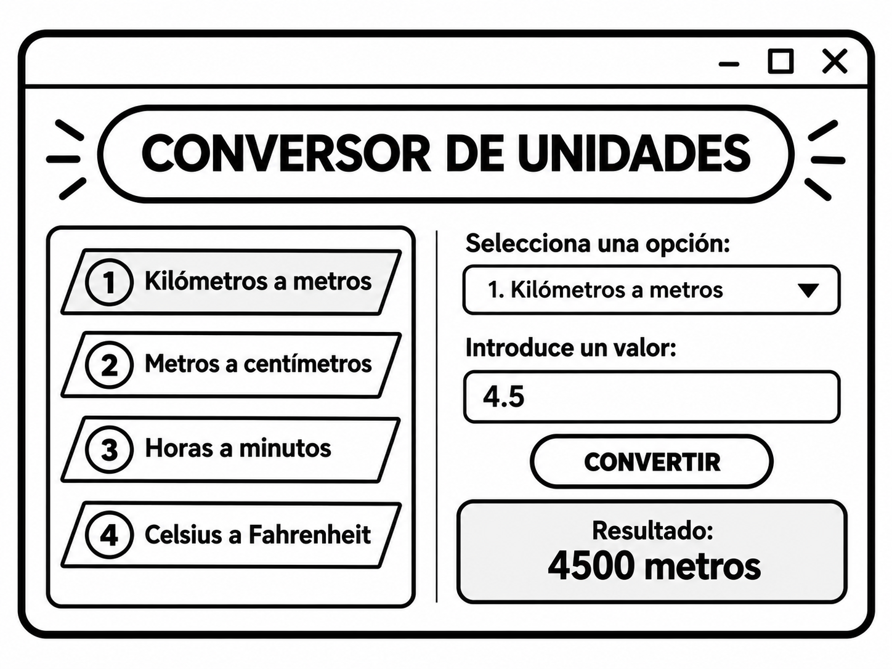
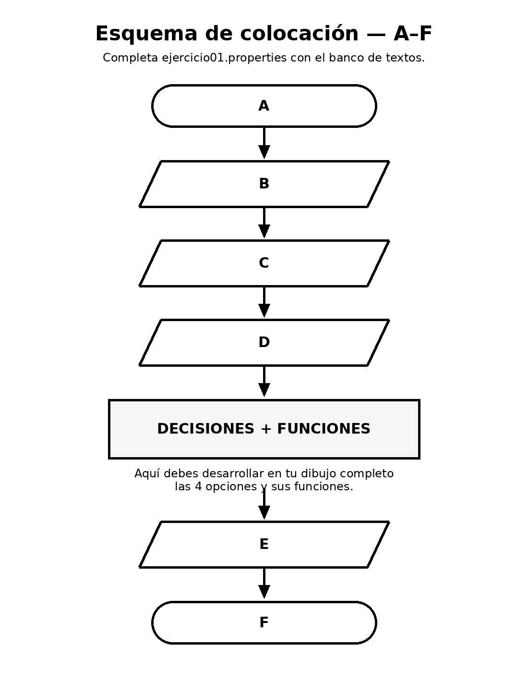

# Ejercicio 1 · Conversor de unidades

**Paquete:** `es.ies.puerto.diagramas`  
**Clase:** `Ejercicio1`  
**Duración orientativa:** 1 hora  
**Puntuación:** 10 puntos

<p align="center">
  
</p>

---

## Objetivo

Construir un programa por consola que permita realizar diferentes conversiones de unidades y representar previamente su funcionamiento mediante un **diagrama de flujo**.

El programa trabajará con estas conversiones:

| Opción | Conversión |
|---|---|
| `1` | Kilómetros → Metros |
| `2` | Metros → Centímetros |
| `3` | Horas → Minutos |
| `4` | Celsius → Fahrenheit |

<p align="center">
  
</p>

> La imagen anterior es únicamente una referencia visual. El ejercicio se realiza mediante **entrada y salida por consola**.

---

# Parte 1 · Diagrama de flujo

Elabora el diagrama completo en el archivo:

```text
diagrama.mmd
```

GitHub puede representar diagramas Mermaid directamente cuando se incluyen en Markdown.

El diagrama debe contener:

- inicio y fin;
- mostrar el menú;
- leer la opción;
- leer el valor;
- las cuatro decisiones;
- las cuatro llamadas a funciones;
- mostrar el resultado;
- controlar una opción no válida;
- las conexiones necesarias entre los elementos.

## Símbolos que debes utilizar

### Inicio / Fin

<p align="center">
  
</p>

En Mermaid, representa Inicio y Fin con un terminador:

```text
([texto])
```

### Entrada / Salida

<p align="center">
  
</p>

### Proceso

<p align="center">
  
</p>

### Decisión

<p align="center">
  
</p>

### Flujo

<p align="center">
  
</p>

---

## 🧩 Textos del diagrama

En el diagrama deberán aparecer los siguientes elementos:

```text
INICIO
Mostrar menú
Leer opción
Leer valor

¿Opción == 1?
kmAMetros(valor)

¿Opción == 2?
metrosACentimetros(valor)

¿Opción == 3?
horasAMinutos(valor)

¿Opción == 4?
celsiusAFahrenheit(valor)

Mostrar resultado
Mostrar "Opción no válida"

FIN
```

---

# 🧠 Parte 2 · Colocación de respuestas

Completa el archivo:

```text
ejercicio01.properties
```

Usa el siguiente banco de textos:

```text
Leer valor
Leer opción
FIN
Mostrar resultado
Mostrar menú
INICIO
```

Debes colocar cada texto en la letra que corresponda al siguiente esquema:

<p align="center">
  
</p>

El archivo tiene este formato:

```properties
A=
B=
C=
D=
E=
F=
```

No cambies las letras ni el nombre del archivo.

---

# Parte 3 · Programa

Trabaja sobre:

```text
src/main/java/es/ies/puerto/diagramas/Ejercicio1.java
```

La clase debe conservar exactamente este paquete y nombre:

```java
package es.ies.puerto.diagramas;

public class Ejercicio1 {
    ...
}
```

El programa debe contener estas funciones estáticas:

```text
kmAMetros(...)
metrosACentimetros(...)
horasAMinutos(...)
celsiusAFahrenheit(...)
```

Todas reciben un valor numérico y devuelven el resultado de la conversión.

## Fórmulas

```text
metros = kilómetros × 1000
centímetros = metros × 100
minutos = horas × 60
fahrenheit = celsius × 9 / 5 + 32
```

El programa principal debe pedir por consola la opción y el valor, llamar a la función correspondiente y mostrar el resultado.

Si la opción no existe, debe mostrarse un mensaje que indique que la opción **no es válida**.

> **Nota**: *El menú es similar al que hemos trabajado en clase con la calculadora.*

---

# Orden de trabajo recomendado

1. Analiza el problema.
2. Construye el diagrama.
3. Completa la colocación A–F.
4. Organiza la clase `Ejercicio1`.
5. Implementa las funciones.
6. Completa el programa principal.
7. Prueba distintas entradas.
8. Ejecuta el autocorrector.

---

# Evaluación automática

La nota se reparte así:

| Bloque | Puntos |
|---|---:|
| Programa Java y pruebas automáticas | **8 puntos** |
| Dibujo del diagrama `diagrama.mmd` | **1 punto** |
| Colocación A–F en `ejercicio01.properties` | **1 punto** |
| **TOTAL** | **10 puntos** |

## Dibujo del diagrama · 1 punto

El autocorrector comprueba:

- declaración del diagrama;
- presencia correcta de **INICIO** y **FIN**;
- entradas y salidas principales;
- cuatro decisiones;
- cuatro funciones;
- conexiones mediante flechas.

## Colocación · 1 punto

Cada una de las seis respuestas del archivo `ejercicio01.properties` aporta la misma parte del punto.

---

# ▶ Cómo lanzar el autocorrector

## Requisitos

Necesitas:

- **Java 21**
- **Maven**
- **Python 3**

Puedes comprobarlos con:

```bash
java -version
mvn -version
python3 --version
```

## Autocorrección completa

Desde la raíz del proyecto ejecuta:

```bash
python3 calcular_nota.py
```

El script:

1. ejecuta los tests Maven;
2. corrige el programa;
3. analiza `diagrama.mmd`;
4. corrige `ejercicio01.properties`;
5. calcula la nota sobre 10;
6. genera el informe:

```text
target/nota.txt
```

También puedes ver solo los tests Java con:

```bash
mvn test
```

---

# Ejemplo del informe

```text
=== AUTOCORRECCIÓN EJERCICIO 1 ===

=== CÓDIGO ===
Tests superados: 10/10
Puntuación código: 8.00/8.00

=== DIAGRAMA: DIBUJO ===
Puntuación dibujo: 1.00/1.00

=== DIAGRAMA: COLOCACIÓN ===
Respuestas correctas: 6/6
Puntuación colocación: 1.00/1.00

=== RESUMEN ===
Código:      8.00/8.00
Dibujo:      1.00/1.00
Colocación:  1.00/1.00
NOTA FINAL:  10.00/10.00
```

---

# GitHub Classroom / GitHub Actions

El proyecto incluye:

```text
.github/workflows/autocorreccion.yml
```

Cada `push` ejecutará automáticamente:

```bash
python3 calcular_nota.py
```

y guardará `target/nota.txt` como artefacto de la ejecución.

---

# Estructura del proyecto

```text
ejercicio1-conversor/
├── .github/
│   └── workflows/
│       └── autocorreccion.yml
├── docs/
│   └── images/
├── src/
│   ├── main/
│   │   └── java/
│   │       └── es/ies/puerto/diagramas/
│   │           └── Ejercicio1.java
│   └── test/
│       └── java/
│           └── es/ies/puerto/diagramas/
│               └── Ejercicio1Test.java
├── calcular_nota.py
├── diagrama.mmd
├── ejercicio01.properties
├── pom.xml
└── README.md
```

---

## Entrega

Debes conservar los nombres indicados y entregar la carpeta ejercicio1-conversor-nombre completo.
